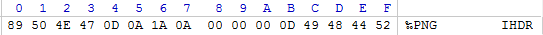

In the final hackfest tunisia ctf 2016 we have a crypto task (100pts) 

[crypto100](https://github.com/chamli/Write_Up_Ctf/blob/master/hackfest2016/crypt100.rar)

so first we open the folder and we get a python code that do encryption and decryption of any file gived with a specific password
we noticed that there is a another files code in the py folder that used to do this job 

after some analyse of the code we get that its a xor encryption with a key (password) 

and also we found a log file 

`computing using ([105, 108, 111, 118, 101, 99, 114, 121, 112, 116, 111, 103, 114, 97, 112, 104, 121])`

convert this we get "ilovecryptography" we used to decrypt enc_mail and its work 
but not with our picture "enc_photo.png"

so what we should do here is a guess of the password used 
but we know the original header of any png file

then i just write a simple script python to get the key by xoring this 8 byte with the 8 byte  of the encrypted png file

`#!/usr/bin/env python`

`f = open('enc_photo.png')`

`enc_data = f.read()[:8]`

`data = '89504E470D0A1A0A'.decode('hex')`

`key = "".join(chr(ord(x) ^ ord(y)) for x, y in zip(data, enc_data))`

`print "key is : " + key`

and we get key is : Garfield :D 

so the last step is to xor the encryption png file with this key and we will get our original png with the flag

there is a helpful tools [xortool](https://github.com/hellman/xortool) 

`$xortool-xor -f enc_photo.png  -s "Garfield" > flag.png `

and pwn :D we get the flag :D 

FLAG{GARFIELD_LOVES_LASAGNES} :D

